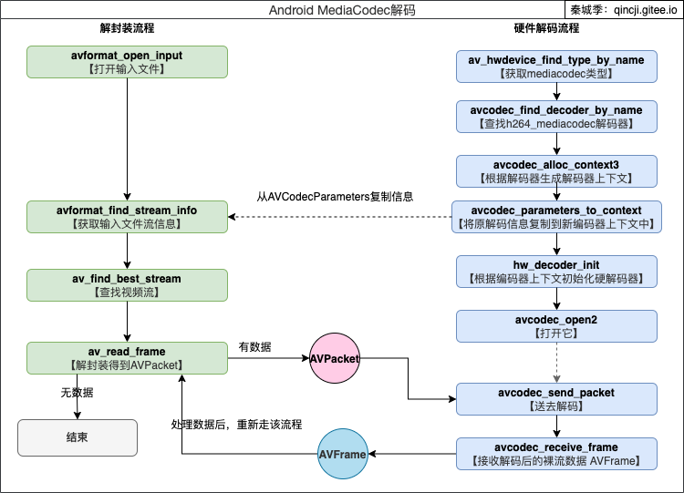

#FFmpeg实现MediaCodec解码

## 简述
`MediaCodec`是Android平台的硬件编解码，`FFmpeg`从3.1版本开始支持，但是，目前支持实现解码功能。[官网硬件编解码支持结束](https://trac.ffmpeg.org/wiki/HWAccelIntro)

## 实现流程

### 一、编译的FFmpeg
为了快速编译，以及减少体积，这里关闭了大部分功能。
```c
#!/bin/bash

API=21
NDK=/Users/Qincji/Desktop/develop/android/source/sdk/ndk/android-ndk-r21
TOOLCHAIN=$NDK/toolchains/llvm/prebuilt/darwin-x86_64

function build_android() {
  ./configure \
    --prefix=$PREFIX \
    --disable-opencl \
    --disable-doc \
    --disable-everything \
    --disable-htmlpages \
    --disable-podpages \
    --disable-debug \
    --disable-programs \
    --disable-demuxers \
    --disable-muxers \
    --disable-decoders \
    --disable-encoders \
    --disable-bsfs \
    --disable-indevs \
    --disable-outdevs \
    --disable-filters \
    --disable-protocols \
    --disable-hwaccels \
    --disable-avdevice \
    --disable-postproc \
    --disable-devices \
    --disable-symver \
    --disable-stripping \
    --disable-asm \
    --disable-w32threads \
    --disable-parsers \
    --disable-shared \
    --enable-static \
    --enable-swscale \
    --enable-protocol=file \
    --enable-protocol=hls \
    --enable-protocol=rtmp \
    --enable-protocol=http \
    --enable-protocol=tls \
    --enable-protocol=https \
    --enable-demuxer=aac \
    --enable-demuxer=h264 \
    --enable-demuxer=mov \
    --enable-demuxer=flv \
    --enable-demuxer=avi \
    --enable-demuxer=hevc \
    --enable-demuxer=gif \
    --enable-parser=h264 \
    --enable-parser=hevc \
    --enable-parser=aac \
    --enable-decoder=aac \
    --enable-decoder=h264 \
    --enable-decoder=flv \
    --enable-decoder=gif \
    --enable-decoder=mpeg4 \
    --enable-bsf=aac_adtstoasc \
    --enable-bsf=h264_mp4toannexb \
    --enable-jni \
    --enable-mediacodec \
    --enable-decoder=h264_mediacodec \
    --enable-decoder=hevc_mediacodec \
    --enable-decoder=mpeg4_mediacodec \
    --enable-hwaccel=h264_mediacodec \
    --enable-neon \
    --enable-gpl \
    --cross-prefix=$CROSS_PREFIX \
    --target-os=android \
    --arch=$ARCH \
    --cpu=$CPU \
    --cc=$CC \
    --cxx=$CXX \
    --enable-cross-compile \
    --sysroot=$SYSROOT \
    --extra-cflags="-Os -fpic $OPTIMIZE_CFLAGS" \
    --extra-ldflags="$ADDI_LDFLAGS" || exit 1
  make clean
  make -j8
  make install
}


#armv8-a
ARCH=arm64
CPU=armv8-a
CC=$TOOLCHAIN/bin/aarch64-linux-android$API-clang
CXX=$TOOLCHAIN/bin/aarch64-linux-android$API-clang++
SYSROOT=$NDK/toolchains/llvm/prebuilt/darwin-x86_64/sysroot
CROSS_PREFIX=$TOOLCHAIN/bin/aarch64-linux-android-
PREFIX=$(pwd)/android/$CPU
OPTIMIZE_CFLAGS="-march=$CPU"
#build_android

#armv7-a
ARCH=arm
CPU=armv7-a
CC=$TOOLCHAIN/bin/armv7a-linux-androideabi$API-clang
CXX=$TOOLCHAIN/bin/armv7a-linux-androideabi$API-clang++
SYSROOT=$NDK/toolchains/llvm/prebuilt/darwin-x86_64/sysroot
CROSS_PREFIX=$TOOLCHAIN/bin/arm-linux-androideabi-
PREFIX=$(pwd)/android/$CPU
OPTIMIZE_CFLAGS="-mfloat-abi=softfp -mfpu=vfp -marm -march=$CPU "
build_android

#x86
ARCH=x86
CPU=x86
CC=$TOOLCHAIN/bin/i686-linux-android$API-clang
CXX=$TOOLCHAIN/bin/i686-linux-android$API-clang++
SYSROOT=$NDK/toolchains/llvm/prebuilt/darwin-x86_64/sysroot
CROSS_PREFIX=$TOOLCHAIN/bin/i686-linux-android-
PREFIX=$(pwd)/android/$CPU
OPTIMIZE_CFLAGS="-march=i686 -mtune=intel -mssse3 -mfpmath=sse -m32"
#build_android

#x86_64
ARCH=x86_64
CPU=x86-64
CC=$TOOLCHAIN/bin/x86_64-linux-android$API-clang
CXX=$TOOLCHAIN/bin/x86_64-linux-android$API-clang++
SYSROOT=$NDK/toolchains/llvm/prebuilt/darwin-x86_64/sysroot
CROSS_PREFIX=$TOOLCHAIN/bin/x86_64-linux-android-
PREFIX=$(pwd)/android/$CPU
OPTIMIZE_CFLAGS="-march=$CPU -msse4.2 -mpopcnt -m64 -mtune=intel"
#build_android
```


### 二、导入
将FFmpeg到Android Studio项目中，编辑`CMakeList.txt`如下：
```cmake
#1、添加版本
cmake_minimum_required(VERSION 3.4.1)

include_directories(include)
file(GLOB core_srcs ${CMAKE_SOURCE_DIR}/core/*.cpp)

#2、编译库，把native-lib.cpp编译成以native-lib为名称的动态库
add_library(
        native-lib
        SHARED
        player_main.cpp ${core_srcs})

#3、设置C++编译参数（CMAKE_CXX_FLAGS是全局变量）
#添加其他预编译库还可以使用这种方式
#使用-L指导编译时库文件的查找路径
#cxx_flags "cxx_flags -L目录"
set(CMAKE_CXX_FLAGS "${CMAKE_CXX_FLAGS} -L${CMAKE_SOURCE_DIR}/libs/${CMAKE_ANDROID_ARCH_ABI}")

#4、链接到库文件，jni/c/c++可以引入链接到
target_link_libraries(
        native-lib
        log
        # 先把有依赖的库，先依赖进来；注意顺序。
        avformat avcodec avfilter avutil swresample swscale
        z
)
```
目录结构见底部项目Demo。

### 三、代码实现
#### 1）给FFmpeg设置JavaVM
```c++
extern "C"
JNIEXPORT
jint JNI_OnLoad(JavaVM *vm, void *res) {
    av_jni_set_java_vm(vm, 0);
    // 返回jni版本
    return JNI_VERSION_1_4;
}
```

#### 2）API流程


#### 3）关键代码
```c++
/**
 * description:   <br>
 * @author 秦城季
 * @email xhunmon@126.com
 * @blog https://qincji.gitee.io
 * @date 2021/2/1
 */

#include "hw_mediacodec.h"

static AVBufferRef *hw_device_ctx = NULL;
static enum AVPixelFormat hw_pix_fmt;
static FILE *output_file = NULL;

static int hw_decoder_init(AVCodecContext *ctx, const enum AVHWDeviceType type) {
    int err = 0;

    if ((err = av_hwdevice_ctx_create(&hw_device_ctx, type,
                                      NULL, NULL, 0)) < 0) {
        HWLOGE("Failed to create specified HW device.\n");
        return err;
    }
    ctx->hw_device_ctx = av_buffer_ref(hw_device_ctx);

    return err;
}

static enum AVPixelFormat get_hw_format(AVCodecContext *ctx,
                                        const enum AVPixelFormat *pix_fmts) {
    const enum AVPixelFormat *p;

    for (p = pix_fmts; *p != -1; p++) {
        if (*p == hw_pix_fmt)
            return *p;
    }

    HWLOGE("Failed to get HW surface format.\n");
    return AV_PIX_FMT_NONE;
}

static int decode_write(AVCodecContext *avctx, AVPacket *packet) {
    AVFrame *frame = NULL, *sw_frame = NULL;
    AVFrame *tmp_frame = NULL;
    uint8_t *buffer = NULL;
    int size;
    int ret = 0;

    ret = avcodec_send_packet(avctx, packet);
    if (ret < 0) {
        HWLOGE("avcodec_send_packet: %d(%s)", ret, av_err2str(ret));
        if(ret != AVERROR(EAGAIN)){
            return ret;
        }
    }

    while (1) {
        if (!(frame = av_frame_alloc()) || !(sw_frame = av_frame_alloc())) {
            HWLOGE("Can not alloc frame\n");
            ret = AVERROR(ENOMEM);
            goto fail;
        }

        ret = avcodec_receive_frame(avctx, frame);
        if (ret == AVERROR(EAGAIN) || ret == AVERROR_EOF) {
            av_frame_free(&frame);
            av_frame_free(&sw_frame);
            return 0;
        } else if (ret < 0) {
            HWLOGE("Error while decoding\n");
            goto fail;
        }

        if (frame->format == hw_pix_fmt) {
            if ((ret = av_hwframe_transfer_data(sw_frame, frame, 0)) < 0) {
                HWLOGE("Error transferring the data to system memory\n");
                goto fail;
            }
            tmp_frame = sw_frame;
        } else
            tmp_frame = frame;

        size = av_image_get_buffer_size(static_cast<AVPixelFormat>(tmp_frame->format),
                                        tmp_frame->width,
                                        tmp_frame->height, 1);
        buffer = static_cast<uint8_t *>(av_malloc(size));
        if (!buffer) {
            HWLOGE("Can not alloc buffer\n");
            ret = AVERROR(ENOMEM);
            goto fail;
        }
        //本次测试所得：AV_PIX_FMT_NV12
        ret = av_image_copy_to_buffer(buffer, size,
                                      (const uint8_t *const *) tmp_frame->data,
                                      (const int *) tmp_frame->linesize,
                                      static_cast<AVPixelFormat>(tmp_frame->format),
                                      tmp_frame->width, tmp_frame->height, 1);
        if (ret < 0) {
            HWLOGE("Can not copy image to buffer\n");
            goto fail;
        }

        if ((ret = fwrite(buffer, 1, size, output_file)) < 0) {
            HWLOGE("Failed to dump raw data.\n");
            goto fail;
        }

        fail:
        av_frame_free(&frame);
        av_frame_free(&sw_frame);
        av_freep(&buffer);
        if (ret < 0)
            return ret;
    }
}


void libffmpeg_log_callback(void *ptr, int level, const char *fmt, va_list vl) {
//    HWLOGD("%8s level=%3d fmt=%5s \n",ptr,level,fmt);
}


HWMediaCodec::HWMediaCodec(const char *srcFilename, const char *dstFilename) {
    AVFormatContext *input_ctx = NULL;
    int video_stream, ret;
//    AVStream *video = NULL;
    AVCodecContext *decoder_ctx = NULL;
    AVCodec *decoder = NULL;
    AVPacket packet;
    enum AVHWDeviceType type;
    int i;

    //设置输出，以及指定日志级别
    av_log_set_level(AV_LOG_DEBUG);
    av_log_set_flags(AV_LOG_SKIP_REPEATED);
    av_log_set_callback(libffmpeg_log_callback);

    //指定编码器类型
    type = av_hwdevice_find_type_by_name("mediacodec");
    if (type == AV_HWDEVICE_TYPE_NONE) {
        HWLOGE("Device type %s is not supported.\n", "mediacodec");
        HWLOGE("Available device types:");
        while ((type = av_hwdevice_iterate_types(type)) != AV_HWDEVICE_TYPE_NONE)
            HWLOGE(" %s", av_hwdevice_get_type_name(type));
        HWLOGE("\n");
        return;
    }

    //解封装打开文件
    if ((ret = avformat_open_input(&input_ctx, srcFilename, NULL, NULL)) != 0) {
        HWLOGE("Couldn't open file %s: %d(%s)", srcFilename, ret, av_err2str(ret));
        return;
    }

    //填充流信息
    if (avformat_find_stream_info(input_ctx, NULL) < 0) {
        HWLOGE("Cannot find input stream information.\n");
        return;
    }

    //查找视频通道
    if ((video_stream = av_find_best_stream(input_ctx, AVMEDIA_TYPE_VIDEO, -1, -1, NULL, 0)) < 0) {
        HWLOGE("Cannot find a video stream in the input file\n");
        return;
    }

    if (!(decoder = avcodec_find_decoder_by_name("h264_mediacodec"))) {
        HWLOGE("avcodec_find_decoder_by_name failed.\n");
        return;
    }

    for (i = 0;; i++) {
        const AVCodecHWConfig *config = avcodec_get_hw_config(decoder, i);
        if (!config) {
            HWLOGE("Decoder %s does not support device type %s.\n",
                   decoder->name, av_hwdevice_get_type_name(type));
            return;
        }
        if (config->methods & AV_CODEC_HW_CONFIG_METHOD_HW_DEVICE_CTX &&
            config->device_type == type) {
            hw_pix_fmt = config->pix_fmt;
            break;
        }
    }

    if (!(decoder_ctx = avcodec_alloc_context3(decoder))) {
        HWLOGE("Cannot find a video stream in the input file%d", AVERROR(ENOMEM));
        return;
    }

    //将参数赋值给新的编码器
    if ((ret = avcodec_parameters_to_context(decoder_ctx, input_ctx->streams[video_stream]->codecpar)) < 0){
        HWLOGE("Couldn't copy param %d(%s)", ret, av_err2str(ret));
        return;
    }

    decoder_ctx->get_format = get_hw_format;

    if (hw_decoder_init(decoder_ctx, type) < 0) {
        return;
    }

    if ((ret = avcodec_open2(decoder_ctx, decoder, NULL)) < 0) {
        HWLOGE("avcodec_open2: %d(%s)", ret, av_err2str(ret));
        return;
    }

    remove(dstFilename);
    output_file = fopen(dstFilename, "wb+");

    while (ret >= 0) {
        if ((ret = av_read_frame(input_ctx, &packet)) < 0)
            break;

        if (video_stream == packet.stream_index)
            ret = decode_write(decoder_ctx, &packet);

        av_packet_unref(&packet);
    }

    packet.data = NULL;
    packet.size = 0;
    ret = decode_write(decoder_ctx, &packet);
    av_packet_unref(&packet);

    if (output_file)
        fclose(output_file);
    avcodec_free_context(&decoder_ctx);
    avformat_close_input(&input_ctx);
    av_buffer_unref(&hw_device_ctx);
}
```

## 输出验证
上面顺利输出后的文件格式是`nv12`的，我们使用`ffplay`进行播放如下：
> ffplay -f rawvideo -video_size 384x216 -pixel_format nv12 -framerate 15 Kobe-384x216.yuv

- **[Demo地址：FFmpegMediaCodecDemo](https://github.com/xhunmon/AFPlayer/tree/main/FFmpegMediaCodecDemo)**
