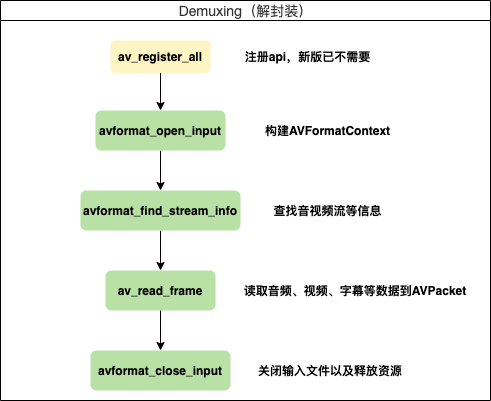

#Demuxing（解封装）

##FFmpeg解封装流程



其中，AVFormatContext、AVPacket等重要的结构体请看：[FFmpeg重要结构体（转自雷神）](./06_struct.md) 。

###（1）avformat_open_input

创建并初始化AVFormatContext结构体，并把输入文件信息赋值到AVFormatContext中。

###（2）avformat_find_stream_info

检索流信息，这个过程会检查输入流中信息是否存在异常，如：AVCodecContext中的extradata是否存在。

###（3）av_read_frame

从文件中读取每一帧的数据到AVPacket中，得到解封装之前的数据。有些（很多吧？）解封装后的数据输出到一个文件中并不支持播放，如FLV。因为FLV解封装后的数据并不是完整一个H264格式视频数据和AAC格式音频数据，需要重新进行封装后再输出到文件中才能正常播放。（或者使用FFmpeg中的工具）


###（4）avformat_close_input

关闭并释放资源。

##例子

参考官方例子`doc/examples/demuxing_decoding.c`。

```c
/**
 * @author 秦城季
 * @email xhunmon@126.com
 * @Blog https://qincji.gitee.io
 * @date 2021/01/03
 * description: FFmpeg Demuxing（解封装）  <br>
 */
extern "C" {
#include <libavformat/avformat.h>
}

int main() {
    const char *src_filename = "source/Kobe.flv";
    const char *out_filename_v = "output/kobe3.h264";//Output file URL
    const char *out_filename_a = "output/kobe.mp3";
    AVFormatContext *fmt_ctx;

    /**(1)*/
    if (avformat_open_input(&fmt_ctx, src_filename, NULL, NULL) < 0) {
        fprintf(stderr, "Could not open source file %s\n", src_filename);
        exit(1);
    }

    /**(2)*/
    if (avformat_find_stream_info(fmt_ctx, NULL) < 0) {
        fprintf(stderr, "Could not find stream information\n");
        exit(1);
    }

    FILE *fp_audio = fopen(out_filename_a, "wb+");
    FILE *fp_video = fopen(out_filename_v, "wb+");

    AVPacket pkt;
    int video_idx = av_find_best_stream(fmt_ctx, AVMEDIA_TYPE_VIDEO, -1, -1, NULL, 0);
    int audio_idx = av_find_best_stream(fmt_ctx, AVMEDIA_TYPE_AUDIO, -1, -1, NULL, 0);
    //使用AVBitStreamFilterContext对FLV视频解封装数据进行处理，封装成 NALU 形式的。
    AVBitStreamFilterContext* h264bsfc =  av_bitstream_filter_init("h264_mp4toannexb");
    //fmt_ctx->streams[video_idx]->codec->extradata包含了sps和pps的数据，需要组装成NALU
    /**(3)*/
    while (av_read_frame(fmt_ctx, &pkt) >= 0) {
        AVPacket orig_pkt = pkt;
        //针对每一个AVPacket进行处理。
        if(orig_pkt.stream_index == video_idx){
            //封装成 NALU 形式的
            av_bitstream_filter_filter(h264bsfc, fmt_ctx->streams[video_idx]->codec, NULL, &orig_pkt.data, &orig_pkt.size, orig_pkt.data, orig_pkt.size, 0);
            fprintf(stderr,"Write Video Packet. size:%d\tpts:%lld\n", orig_pkt.size, orig_pkt.pts);
            fwrite(orig_pkt.data, 1, orig_pkt.size, fp_video);
        } else if(orig_pkt.stream_index == audio_idx){
            fprintf(stderr,"Write Audio Packet. size:%d\tpts:%lld\n", orig_pkt.size, orig_pkt.pts);

        }

        av_packet_unref(&orig_pkt);
    }
    av_bitstream_filter_close(h264bsfc);
    /**(4)*/
    avformat_close_input(&fmt_ctx);
}
```

##[测试文件下载地址](./07_flv/Kobe.flv)