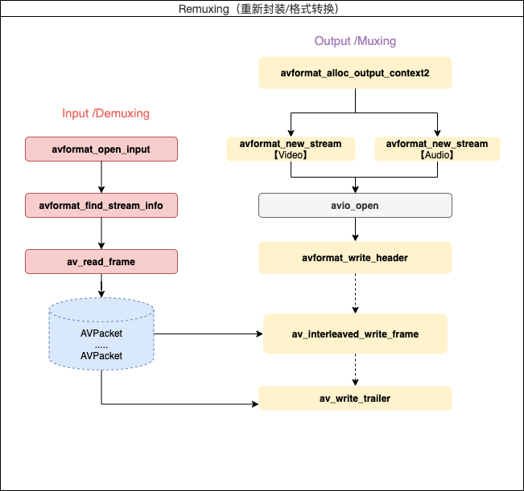

#Remuxing（重新封装）

本文来自官方例子`doc/examples/remuxing.c` 。

##FFmpeg解封装流程



其中，AVFormatContext、AVPacket等重要的结构体请看：[FFmpeg重要结构体（转载）](./06_struct.md) 。

重新封装的原理就是把输入文件 [解封装](./08_demuxing.md) 之后，再进行 [封装](./09_muxing.md) 输出到新的文件中。

##官方例子
```c
/**
 * @author 秦城季
 * @email xhunmon@126.com
 * @Blog https://qincji.gitee.io
 * @date 2021/01/04
 * description: FFmpeg 重新封装  <br>
 */
#define __STDC_CONSTANT_MACROS
extern "C" {
#include <libavutil/timestamp.h>
#include <libavformat/avformat.h>
}

static void log_packet(const AVFormatContext *fmt_ctx, const AVPacket *pkt, const char *tag) {
    AVRational *time_base = &fmt_ctx->streams[pkt->stream_index]->time_base;

    printf("%s: pts:%s pts_time:%s dts:%s dts_time:%s duration:%s duration_time:%s stream_index:%d\n",
           tag,
           av_ts2str(pkt->pts), av_ts2timestr(pkt->pts, time_base),
           av_ts2str(pkt->dts), av_ts2timestr(pkt->dts, time_base),
           av_ts2str(pkt->duration), av_ts2timestr(pkt->duration, time_base),
           pkt->stream_index);
}

int main(int argc, char **argv) {
    AVOutputFormat *ofmt = NULL;
    AVFormatContext *ifmt_ctx = NULL, *ofmt_ctx = NULL;
    AVPacket pkt;
    const char *in_filename, *out_filename;
    int ret, i;
    int stream_index = 0;
    int *stream_mapping = NULL;
    int stream_mapping_size = 0;

    in_filename = "source/Kobe.flv";
    out_filename = "output/Kobe.mp4";

    if ((ret = avformat_open_input(&ifmt_ctx, in_filename, 0, 0)) < 0) {
        fprintf(stderr, "Could not open input file '%s'", in_filename);
        goto end;
    }

    if ((ret = avformat_find_stream_info(ifmt_ctx, 0)) < 0) {
        fprintf(stderr, "Failed to retrieve input stream information");
        goto end;
    }

    av_dump_format(ifmt_ctx, 0, in_filename, 0);

    avformat_alloc_output_context2(&ofmt_ctx, NULL, NULL, out_filename);
    if (!ofmt_ctx) {
        fprintf(stderr, "Could not create output context\n");
        ret = AVERROR_UNKNOWN;
        goto end;
    }

    stream_mapping_size = ifmt_ctx->nb_streams;
    stream_mapping = static_cast<int *>(av_mallocz_array(stream_mapping_size, sizeof(*stream_mapping)));
    if (!stream_mapping) {
        ret = AVERROR(ENOMEM);
        goto end;
    }

    ofmt = ofmt_ctx->oformat;

    for (i = 0; i < ifmt_ctx->nb_streams; i++) {
        AVStream *out_stream;
        AVStream *in_stream = ifmt_ctx->streams[i];
        AVCodecParameters *in_codecpar = in_stream->codecpar;

        if (in_codecpar->codec_type != AVMEDIA_TYPE_AUDIO &&
            in_codecpar->codec_type != AVMEDIA_TYPE_VIDEO &&
            in_codecpar->codec_type != AVMEDIA_TYPE_SUBTITLE) {
            stream_mapping[i] = -1;
            continue;
        }

        stream_mapping[i] = stream_index++;

        out_stream = avformat_new_stream(ofmt_ctx, NULL);
        if (!out_stream) {
            fprintf(stderr, "Failed allocating output stream\n");
            ret = AVERROR_UNKNOWN;
            goto end;
        }

        ret = avcodec_parameters_copy(out_stream->codecpar, in_codecpar);
        if (ret < 0) {
            fprintf(stderr, "Failed to copy codec parameters\n");
            goto end;
        }
        out_stream->codecpar->codec_tag = 0;
    }
    av_dump_format(ofmt_ctx, 0, out_filename, 1);

    if (!(ofmt->flags & AVFMT_NOFILE)) {
        ret = avio_open(&ofmt_ctx->pb, out_filename, AVIO_FLAG_WRITE);
        if (ret < 0) {
            fprintf(stderr, "Could not open output file '%s'", out_filename);
            goto end;
        }
    }

    ret = avformat_write_header(ofmt_ctx, NULL);
    if (ret < 0) {
        fprintf(stderr, "Error occurred when opening output file\n");
        goto end;
    }

    while (1) {
        AVStream *in_stream, *out_stream;

        ret = av_read_frame(ifmt_ctx, &pkt);
        if (ret < 0)
            break;

        in_stream = ifmt_ctx->streams[pkt.stream_index];
        if (pkt.stream_index >= stream_mapping_size ||
            stream_mapping[pkt.stream_index] < 0) {
            av_packet_unref(&pkt);
            continue;
        }

        pkt.stream_index = stream_mapping[pkt.stream_index];
        out_stream = ofmt_ctx->streams[pkt.stream_index];
        log_packet(ifmt_ctx, &pkt, "in");

        /* copy packet */
        pkt.pts = av_rescale_q_rnd(pkt.pts, in_stream->time_base, out_stream->time_base,
                                   static_cast<AVRounding>(AV_ROUND_NEAR_INF | AV_ROUND_PASS_MINMAX));
        pkt.dts = av_rescale_q_rnd(pkt.dts, in_stream->time_base, out_stream->time_base,
                                   static_cast<AVRounding>(AV_ROUND_NEAR_INF | AV_ROUND_PASS_MINMAX));
        pkt.duration = av_rescale_q(pkt.duration, in_stream->time_base, out_stream->time_base);
        pkt.pos = -1;
        log_packet(ofmt_ctx, &pkt, "out");

        ret = av_interleaved_write_frame(ofmt_ctx, &pkt);
        if (ret < 0) {
            fprintf(stderr, "Error muxing packet\n");
            break;
        }
        av_packet_unref(&pkt);
    }

    av_write_trailer(ofmt_ctx);
    end:

    avformat_close_input(&ifmt_ctx);

    /* close output */
    if (ofmt_ctx && !(ofmt->flags & AVFMT_NOFILE))
        avio_closep(&ofmt_ctx->pb);
    avformat_free_context(ofmt_ctx);

    av_freep(&stream_mapping);

    if (ret < 0 && ret != AVERROR_EOF) {
        fprintf(stderr, "Error occurred: %s\n", av_err2str(ret));
        return 1;
    }

    return 0;
}

```

##测试文件下载地址: [Kobe.flv](../MustRead/01_flv/Kobe.flv) 。
