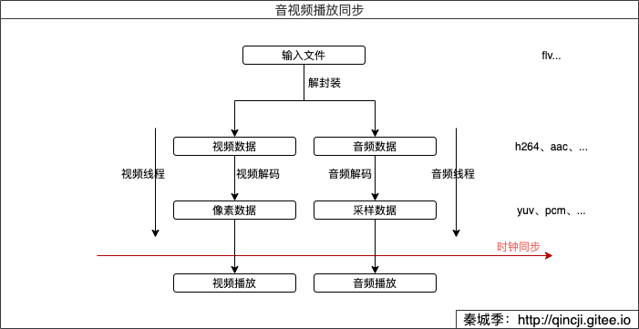

#音视频同步处理

## 播放流程



从图中我们得到一个重要的名称，叫做"时钟"。视频和音频是两个不相干的线程，各自进行播放，而各自播放的进度都需要参考这个"时钟"，才能使得播放同步。其实这里说的"进度"就是我们熟悉`pts`，所以下面主要扒编解码中`pts`的那些点。讲之前，先讲讲三种类型的时钟处理。

## 时钟同步处理

### 时钟类型
- 音频时钟：即以音频进度作为参考时钟，音频播放进度为准。由于耳朵感官上比眼睛更敏感，所以大多少采用这种形式。缺点是画面可能出现卡段或跳帧的情况。
- 视频时钟：即以视频进度作为参考时钟，视频播放进度为准。
- 外部时钟：即以外部进度（时间戳）作为参考时钟。

### 处理逻辑
当音频/视频帧播放的进度大于参考时钟的进度时，需要让该帧等待播放；当音频/视频帧播放的进度小于参考时钟的进度时，需要快速播放完或者丢弃该帧处理。
总结来说就三个词："等待" 和 "快速"或"丢弃"。

## 裸数据"同步"播放
我们首先再去简单屡屡音视频的一些基本概念，因为分析音视频同步不同步，理论知识真的很重要！播放的都是解码后的裸数据（yuv、pcm），如果视频跟音频两个裸数据源本身播放就不同步，再怎么处理也是徒劳。

### 影响视频播放进度的因素

总数据大小 = 一帧大小 x 每一秒播放的帧数（fps）x 时间

当我们做视频编解码、转换格式或滤镜处理等等时，如果出现过重新封装之后播放发现时间对不上了，那很可能你对这几个基本概念还不熟悉，看看这两篇补补？[直播推流全过程：视频数据源之YUV（1）](./../直播推流全过程/1-yuv.md) 、[视音频数据处理入门：RGB、YUV像素数据处理](https://blog.csdn.net/leixiaohua1020/article/details/50534150) 

- 一帧大小：根据视频数据格式计算，如rgb=width x height x 3; yuv420=width x height x 3 / 2 ; .....
- 帧率: 每一秒播放帧的数量，单位：fps（frame per second）。
- 比特率(码率)： 就是： 一帧大小 x 每一秒播放的帧数（fps）。

### 影响音频播放进度的因素

数据大小（单位：字节）= 采样率 x (位宽 / 8) x 声道数 x 时间

- 采样率：每秒钟采样次数，如：44100。
- 位宽：常见有8位、16位、32位；即对应1个字节、2个字节、4个字节。
- 声道数：常用单声道、双声道；即对应1个声道数，2个声道数。

还不是很熟悉的朋友请往这补补？[直播推流全过程：音频数据源之PCM（2）](./../直播推流全过程/2-pcm.md) 、[视音频数据处理入门：PCM音频采样数据处理](http://blog.csdn.net/leixiaohua1020/article/details/50534316)

### 同时播放视频和音频
这里所说是"同时"播放，而非同步，是因为我们并没有做同步处理，只是根据理论知识让它们各自播放，效果上展示出来同步的效果。
来实践一下？
1. 把 [Kobe.flv](./07_flv/Kobe.flv) 这个视频解码后做些滤镜等处理后得到yuv、pcm的裸数据后进行播放。解码过程参看：[FFmpeg 简单实现转码](./13_transfer.md) 和 [FFmpeg Transcode(转码)](./16_transcode.md) 。

2. 解码后的数据如下：
```commandline
qincji:VAFFmpeg mac$ ls -lsh source/
 109864 -rw-r--r--  1 mac  staff    53M  1 16 11:29 Kobe-384x216-15fps.yuv
  20672 -rw-r--r--@ 1 mac  staff    10M  1 10 11:06 Kobe-44100-2-32-33ks.pcm
```

3. 进行播放
我这使用`Audition`播放音频，设置如下：

若使用ffplay，则使用命令：
> ffplay -ar 44100 -channels 2 -f f32le -i  source/Kobe-44100-2-32-33ks.pcm

使用ffplay播放视频
> ffplay -f rawvideo -framerate 15 -video_size 384x216 source/Kobe-384x216-15fps.yuv

播放显示的同步效果：


## 编解码同步处理
首先我们先了解一下FFmpeg中有关显示处理的几个重要知识点：
- `pts`：用来显示的时间戳，单位：`AVStream->time_base`。
- `dts`：用来解码的时间戳，单位：`AVStream->time_base`。
- `duration`：数据时长，单位：`AVStream->time_base`。

编解码同步处理是指：音视频转码的过程（如格式转换、视频合并等）。需要把视频解封装、解码后重新编码、封装成新的文件，这个过程需要精准的处理pts、dts和duration才能保证播放的过程同步。

### 转码流程回顾


上图中三个具有颜色的点，红色是转码过程中必须要处理的，而绿色则根据实际情况而定。
以下处理的代码位置在[FFmpeg Transcode(转码)](./16_transcode.md) 中。

### 1. 处理之前相关函数
1) `AVRational time_base` ：时间基；我们只需设置编码的时间基，其他框架自动生成。设置方式：

视频：(应保持跟解码保持一致)
```c
time_base = {1, fps}; //如time_base = {1, 30}
```
音频：
```c
time_base = {1, sample}; //如time_base = {1, 44100} 
```

2）`AVCodecContext->frame_size`：音频帧中每个通道的样本数，跟`nb_samples`的值一样。所以：
> 一帧大小(单位：字节) = frame_size x 位宽 x 声道数

这里需要特别注意的是，编码时`frame_size`的大小跟采样率（`sample_rate`）并没有关系，它是跟音频编码器类型相关的，如：
`avcodec_open2 -> avctx->codec->init(avctx)` 这将会调用AVCodec(编码器)中的对应的`init`，如`AV_CODEC_ID_AAC`编码器：
```c
AVCodec ff_aac_encoder = {
    .name           = "aac",
    .long_name      = NULL_IF_CONFIG_SMALL("AAC (Advanced Audio Coding)"),
    .type           = AVMEDIA_TYPE_AUDIO,
    .id             = AV_CODEC_ID_AAC,
    .priv_data_size = sizeof(AACEncContext),
    .init           = aac_encode_init,
    .encode2        = aac_encode_frame,
    .close          = aac_encode_end,
    .defaults       = aac_encode_defaults,
    .supported_samplerates = mpeg4audio_sample_rates,
    .caps_internal  = FF_CODEC_CAP_INIT_THREADSAFE,
    .capabilities   = AV_CODEC_CAP_SMALL_LAST_FRAME | AV_CODEC_CAP_DELAY,
    .sample_fmts    = (const enum AVSampleFormat[]){ AV_SAMPLE_FMT_FLTP,
                                                     AV_SAMPLE_FMT_NONE },
    .priv_class     = &aacenc_class,
};
```
然后会调用：`aac_encode_init -> avctx->frame_size = 1024` ，这也就是当指定编码器后，怎么也改变不了`frame_size`的值的原因。


3) `av_packet_rescale_ts` : 简单理解为，将`pkt`的pts、dts和duration值从原来的，以`tb_dst`为标准转换为现在的有效。
```c
/**
 * Convert valid timing fields (timestamps / durations) in a packet from one
 * timebase to another. Timestamps with unknown values (AV_NOPTS_VALUE) will be
 * ignored.
 *
 * @param pkt packet on which the conversion will be performed
 * @param tb_src source timebase, in which the timing fields in pkt are
 *               expressed
 * @param tb_dst destination timebase, to which the timing fields will be
 *               converted
 */
void av_packet_rescale_ts(AVPacket *pkt, AVRational tb_src, AVRational tb_dst);
```
我们从源码上来看：
```c
void av_packet_rescale_ts(AVPacket *pkt, AVRational src_tb, AVRational dst_tb)
{
    if (pkt->pts != AV_NOPTS_VALUE)
        pkt->pts = av_rescale_q(pkt->pts, src_tb, dst_tb);
    if (pkt->dts != AV_NOPTS_VALUE)
        pkt->dts = av_rescale_q(pkt->dts, src_tb, dst_tb);
    if (pkt->duration > 0)
        pkt->duration = av_rescale_q(pkt->duration, src_tb, dst_tb);
//忽略以下...
}
```

### 2. 解码前处理（红色上AVPacket）
解码之前需要AVPacket的pts、dts、duration的值重新转换，如下：
```c
av_packet_rescale_ts(de_pkt,
      ifmt_ctx->streams[stream_index]->time_base,
      ifmt_ctx->streams[stream_index]->codec->time_base);
```
编码之后这几个数据值会传递给AVFrame，进行下去。

### 3. 裸数据处理（绿色AVFrame）
解码之后得到的AVFrame中装的就是裸数据，当我们需要对该数据进行加工后，结果可能是出现多个AVFrame数据，当出现这种情况时，需要重新计算当前`AVFrame.pkt_dts`和`AVFrame.pts`的值后，才能送去编码(`avcodec_send_frame`)，否则会造成音视频的不同步。
具体要怎么设置呢？哈哈，我也在找答案中…… 不过我在某个音频编码的源码中找到一段是这么转换的`pts`的：
```c
int ff_af_queue_add(AudioFrameQueue *afq, const AVFrame *f)
{
    AudioFrame *new = av_fast_realloc(afq->frames, &afq->frame_alloc, sizeof(*afq->frames)*(afq->frame_count+1));
    if(!new)
        return AVERROR(ENOMEM);
    afq->frames = new;
    new += afq->frame_count;

    /* get frame parameters */
    new->duration = f->nb_samples;
    new->duration += afq->remaining_delay;
    if (f->pts != AV_NOPTS_VALUE) {
        //转换新的pts
        new->pts = av_rescale_q(f->pts,
                                      afq->avctx->time_base,
                                      (AVRational){ 1, afq->avctx->sample_rate });
        //然后再减去 avctx->initial_padding 的值
        new->pts -= afq->remaining_delay;
        if(afq->frame_count && new[-1].pts >= new->pts)
            av_log(afq->avctx, AV_LOG_WARNING, "Queue input is backward in time\n");
    } else {
        new->pts = AV_NOPTS_VALUE;
    }
    afq->remaining_delay = 0;

    /* add frame sample count */
    afq->remaining_samples += f->nb_samples;

    afq->frame_count++;

    return 0;
}

// remaining_delay的值初始化
av_cold void ff_af_queue_init(AVCodecContext *avctx, AudioFrameQueue *afq)
{
    afq->avctx = avctx;
    afq->remaining_delay   = avctx->initial_padding;
    afq->remaining_samples = avctx->initial_padding;
    afq->frame_count       = 0;
}
```
上面计算新的`pts`的方式，我测试验证了一下，确实如此。

总结一下上面的情况（音频）：
也就是说当音频处理后出现多帧（AVFrame）的情况下，在编码(`avcodec_send_frame`)前，需要根据当前设置编码的`time_base`和`sample_rate`重新设置`pts`才能保证编码后的音频才不会"变形"。这里给我的解决方案（代码源同上）：
```c
 //当解码的帧数与送去编码的帧数有差别时，我们必须更改pts和dts的值，否者封装时av_packet_rescale_ts（计算）pts和dts有重复，会出问题
if (filt_frame->nb_samples != enc_ctx->frame_size) {
    resample_pos += enc_ctx->frame_size;
    //编码前重新给pts和dts赋值
    reasampling_frame->pts = resample_pos;
    reasampling_frame->pkt_dts = resample_pos;
}
```

注：上面处理方案没有针对视频流测试过，但思路是一样的，看编码前的裸数据在你给定的fps播放下，总的帧数播放完跟原来时长是否一致，再然后定义新的`pts`。


### 4. 编码后处理（红色右AVPacket）
```c
enc_pkt->stream_index = stream_index;
av_packet_rescale_ts(enc_pkt,
                     ofmt_ctx->streams[stream_index]->codec->time_base,
                     ofmt_ctx->streams[stream_index]->time_base);
enc_pkt->pos = -1;
```

## 后话
造成音视频不同步的原因有很多种，学会分析其中的原因才是我们想要的，其中最好的方式就是看别人怎么做的。如果你在做播放的过程想参考一下音视频同步处理不妨看一下`fftools/ffplay.c` 。
