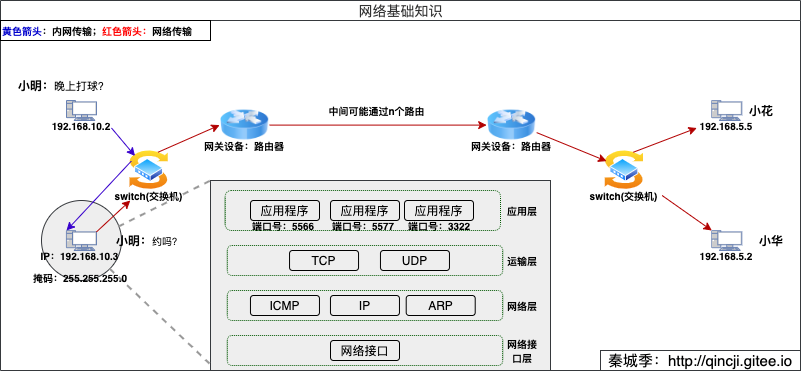
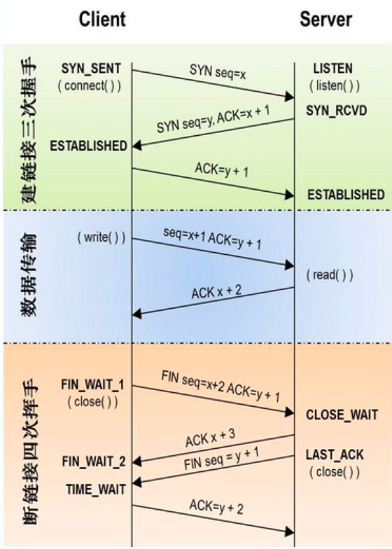

#网络基础知识

## 通信简单流程

上图简单的描述了一下网络通信的过程，通过上面的知识点来描述一下网络基础知识，补补这方面的基础知识。

### IP
Internet上每一台计算机都有唯一的地址来标识它的身份，即IP地址，使用域名其实也是要转化为IP地址的。IP地址的结构为`x.x.x.x`，每个`x`的值0~255（1Btye的范围）。IP地址分类如下：

由上图可知，把IP地址转换为二进制时，根据最高的位第一个0开始区分什么类型，所以IP的组成结构为：
> IP =  网络地址(含类型标识) + 主机地址 

上图所示的结构是固定的，但是实际上除了`类型标识`固定之外，`网络地址`和`主机地址`占位却是不固定的，如B类地址：
IP地址：180.210.242.131；        即：10110100.11010010.11110010.10000011
同时掩码：255.255.248.0；         即：11111111.11111111.11111000.00000000
网络地址：两者进行`与`运算；         即：10110100.11010010.11110000.00000000（180.210.240.0）
主机地址：掩码`取反`再和IP做`与`运算，即：00000000.00000000.00000010.10000011（0.0.2.131）

B类的网络地址应该为：xx*******.********.xxxxxxxx.xxxxxxxx
但真实的网络地址却是：xx110100.11010010.11110xxx.xxxxxxxx

所以本来的网络号是16位，但它实际网络号是21位，就是借了5位网络位，所以可以划分2^5^个子网，即32个，实际使用30个，这个网段可以容纳主机2^11^个，即2048个，有效2046个一头一尾分别做网络号和广播。

### ⼦⽹掩码
⼦⽹掩码只有⼀个作⽤，就是将某个IP地址划分成⽹络地址和主机地址两部分⼦⽹掩码的设定必须遵循⼀定的规则。与IP地址相同，⼦⽹掩码的⻓度也是32位：
- 左边是⽹络位，⽤⼆进制数字“1”表示；
- 右边是主机位，⽤⼆进制数字“0”表示。

### 端口
通信过程中通过IP地址找到了该台电脑后，需要再跟进端口号来识别该通过那个`应用程序`。端⼝号只有整数，范围是从0到65535。
端口号有知名端口和动态端口。知名端⼝是众所周知的端⼝号，范围从0到1023（类似电话中的110、119等）。⼀般情况下，如果⼀个程序需要使⽤知名端⼝的需要有root权限。
- 80端⼝分配给HTTP服务
- 21端⼝分配给FTP服务

### 网关
网关(Gateway)又称网间连接器、协议转换器，实质上是一个网络通向其他网络的IP地址。这一设备成为网关设备，路由器就是了。根据"路由"协议进行不同网段的信息传递，如图：

### UDP
⽤户数据报协议，是⼀个⽆连接的简单的⾯向数据报的运输层协议。UDP不提供可靠性，它只是把应⽤程序传给IP层的数据报发送出去，但是并不能保证它们能到达⽬的地。由于UDP在传输数据报前不⽤在客户和服务器之间建⽴⼀个连接，且没有超时重发等机制，故⽽传输速度很快。UDP是⼀种⾯向⽆连接的协议，每个数据报都是⼀个独⽴的信息，包括完整的源地址或⽬的地址，它在⽹络上以任何可能的路径传往⽬的地，因此能否到达⽬的地，到达⽬的地的时间以及内容的正确性都是不能被保证的。

UDP特点：
UDP是⾯向⽆连接的通讯协议，UDP数据包括⽬的端⼝号和源端⼝号信息，由于通讯不需要连接，所以可以实现⼴播发送。 UDP传输数据时有⼤⼩限制，每个被传输的数据报必须限定在64KB之内。 UDP是⼀个不可靠的协议，发送⽅所发送的数据报并不⼀定以相同的次序到达接收⽅。

UDP是⾯向消息的协议，通信时不需要建⽴连接，数据的传输⾃然是不可靠的，UDP⼀般⽤于多点通信和实时的数据业务，⽐如：
- 语⾳⼴播
- 视频
- QQ
- TFTP(简单⽂件传送）
- SNMP（简单⽹络管理协议）
- RIP（路由信息协议，如报告股票市场，航空信息）
- DNS(域名解释）

UDP操作简单，⽽且仅需要较少的监护，因此通常⽤于局域⽹⾼可靠性的分散系统中client/server应⽤程序。例如视频会议系统，并不要求⾳频视频数据绝对的正确，只要保证连贯性就可以了，这种情况下显然使⽤UDP会更合理⼀些。

### TCP

#### TCP长/短连接优缺点
⻓连接可以省去较多的TCP建⽴和关闭的操作，减少浪费，节约时间。对于频繁请求资源的客户来说，较适⽤⻓连接。但是，client与server之间的连接如⼀直不关闭的话，会存在⼀个问题，随着客户端连接越来越多，server早晚有扛不住的时候，这时候server端需要采取⼀些策略，如关闭⼀些⻓时间没有读写事件发⽣的连接，这样可以避免⼀些恶意连接导致server端服务受损；如果条件再允许就可以以客户端机器为颗粒度，限制每个客户端的最⼤⻓连接数，这样可以完全避免某个蛋疼的客户端连累后端服务。短连接对于服务器来说管理较为简单，存在的连接都是有⽤的连接，不需要额外的控制⼿段。但如果客户请求频繁，将在TCP的建⽴和关闭操作上浪费时间和带宽。

## 其他
- 抓包工具推荐：wireshark
- 模拟网络环境：Packet Tracer

参考
- https://blog.csdn.net/zhangbaoanhadoop/article/details/82745769
